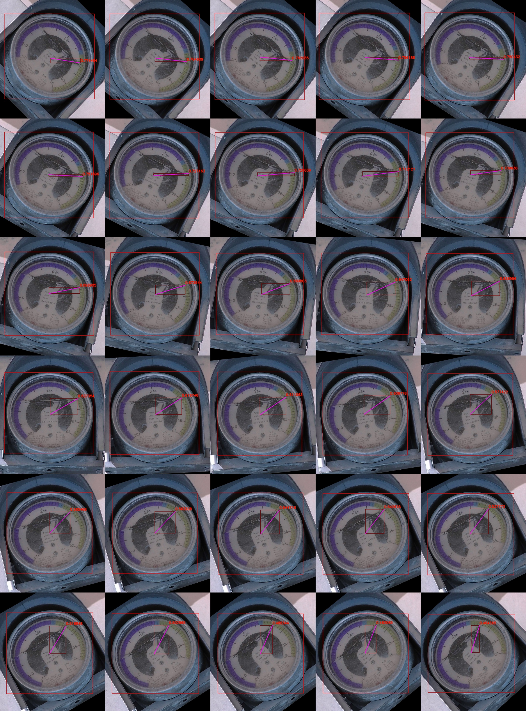

# Instrument Pointer Detection Based on Object Detection

The pointer is encoded by two boxes, one cover the pointer another is used to decode the orientation.

Some enhancement methods is used to increase the robustness.

